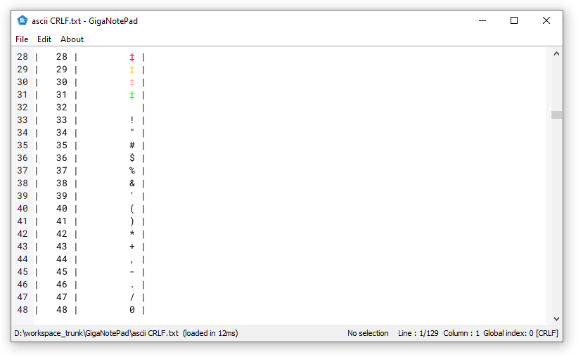

# GigaNotePad

## Overview

**GigaNotePad** is an open-source notepad application designed to handle exceptionally large text files, up to 2 gigabytes in size, even if all the text is contained in a single line. 
This tool is ideal for users who need to work with extensive logs, data dumps, or any large text files that typically exceed the capabilities of standard text editors.

## Features

- **High Performance**: Efficiently open, edit, and save very large files.
- **Single Line Handling**: Optimized to handle files where all content is in a single line.
- **Search and Replace**: Fast search and replace functionality.
- **Cross-Platform**: Runs on Windows, macOS, and Linux.

## Screenshots

## Screenshots

Requirement : Java 11 or superior

